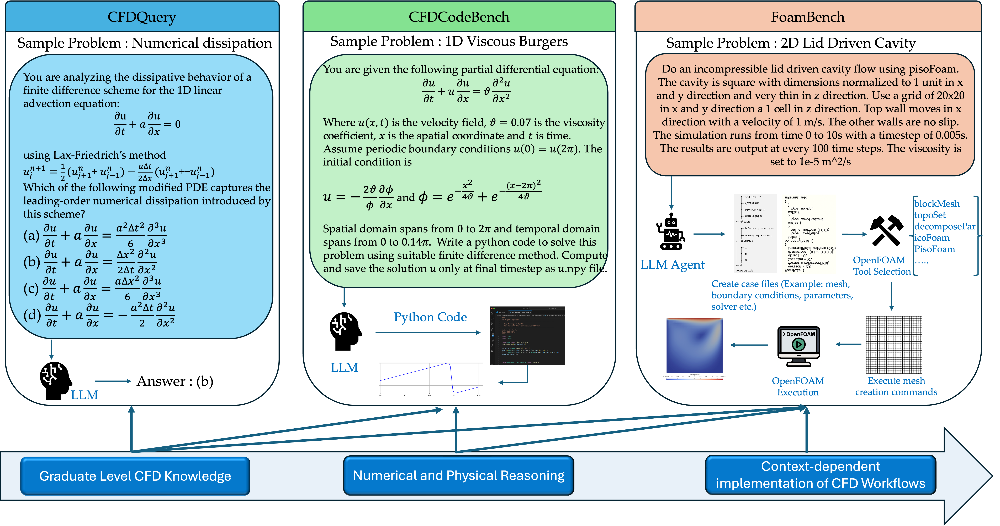
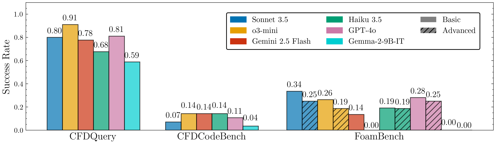

# CFDLLMBench

**CFDLLMBench** is a comprehensive benchmark suite designed to assess Large Language Models (LLMs) on key competencies relevant to computational fluid dynamics (CFD). It evaluates LLMs across three interconnected tasks:

- ✅ **CFDQuery**: Conceptual understanding through multiple-choice CFD questions.
- ✅ **CFDCodeBench**: Instruction-following ability to generate CFD code.
- ✅ **FoamBench**: End-to-end automation of OpenFOAM simulations from natural language.

---

## 🔍 Motivation

While LLMs excel in general NLP, their ability to reason about scientific systems, generate structured physical code, and interface with domain-specific simulators like OpenFOAM remains underexplored.

**CFDLLMBench** bridges this gap by systematically measuring:
- Conceptual grasp of CFD principles (via QA),
- Structured code generation fidelity,
- Robustness of simulation execution and output.

---

## 🧱 Benchmark Components

### 📘 CFDQuery

- 90 graduate-level multiple-choice questions from CFD lectures.
- Covers numerical methods, turbulence modeling, and solver theory.
- LLMs select the correct option from four choices.

### 🔧 CFDCodeBench

- 24 natural language prompts describing CFD problems.
- Models must output executable CFD code (FDM, FVM, etc.).
- Evaluated on correctness, numerical stability, and output similarity.

### 🌀 FoamBench

- 110 Basic + 16 Advanced OpenFOAM simulation tasks.
- Benchmarks end-to-end tool use: case creation → execution → postprocessing.
- Assesses multi-step reasoning, domain adaptation, and recovery.

---

## 🖼️ Benchmark Overview



---

## 📈 Main Results



---

## 📄 License

This benchmark is open-source and released under license: BSD-3-Clause.

## Citation
If you use CFD-LLMBench in your research, please cite our paper:
```bibtex

@article{somasekharan2025cfdllmbench,
    title={CFDLLMBench: A Benchmark Suite for Evaluating Large Language Models in Computational Fluid Dynamics},
    author={Somasekharan, Nithin and Yue, Ling and Cao, Yadi and Li, Weichao and Emami, Patrick and Bhargav, Pochinapeddi Sai and Acharya, Anurag and Xie, Xingyu and Pan, Shaowu},
    journal={Journal of Data-centric Machine Learning Research},
    year={2025},
    url={https://openreview.net/forum?id=kTcH1MnkjY}
}

```
